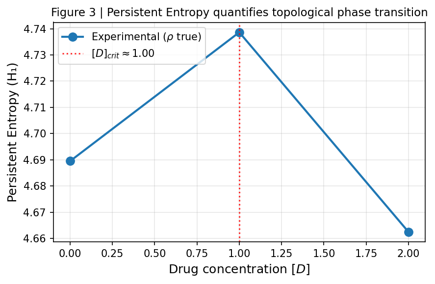

# Receptor-Constrained Dynamical Topology (RCDT) Hypothesis

[](https://doi.org/10.64898/2026.02.04.703742)

**Preprint now live on bioRxiv.** A computational framework bridging molecular pharmacology and whole-brain dynamics through topological data analysis. The RCDT hypothesis proposes that receptor-weighted gain modulation induces **topological phase transitions** in neural attractors—detectable as non-linear jumps in Persistent Entropy across drug concentration.

---

## Central Result: Topological Phase Transition

The key prediction of the RCDT hypothesis is a **non-linear jump** in Persistent Entropy (H₁) as drug concentration [D] crosses a critical threshold. Below [D]<sub>crit</sub>, the attractor remains low-dimensional; above it, the topology fragments—consistent with *ego dissolution* as operational Betti-1 stability breakdown.

<p align="center"></p>

*Figure 3 | Persistent Entropy vs drug concentration [D]. The experimental curve (true receptor map ρ) is compared against the shuffled control (ρ<sub>π</sub>). A non-linear jump supports the phase transition hypothesis; divergence between curves supports 5-HT2A receptor-specificity.*

---

## Overview

- **Model**: 30-node Wilson–Cowan E-I dynamics on structural connectivity with axonal delays
- **Pharmacology**: Gain modulation G<sub>i</sub> = G<sub>0</sub> + k·ρ<sub>i</sub>·[D] weighted by 5-HT2A receptor density
- **Topology**: Takens embedding + Vietoris–Rips persistent homology
- **Integration**: Euler–Maruyama with small Brownian noise (prevents fixed-point trapping)

See [`RCDT_bioRxiv_manuscript.md`](RCDT_bioRxiv_manuscript.md) for the full manuscript.

---

## Installation

```bash
git clone https://github.com/lincNK/RCDT-Model.git
cd RCDT-Model
pip install -r requirements.txt
```

**Requirements**: `numpy`, `scipy`, `matplotlib`, `ripser`, `persim`

---

## Usage

### Figure 1: TDA Pipeline Calibration (Van der Pol vs Lorenz)

```bash
python figure1_persistence_diagram.py
```

Output: `figs/fig1_tda_validation.png`

### Figure 2 & 3: Whole-Brain Model and Persistent Entropy

```bash
# Main simulation (5 concentration levels, outputs to figs/)
python figure2_simulation.py

# Quick mode (3 levels, shorter simulation)
python figure2_simulation.py --quick

# Include receptor shuffling control
python figure2_simulation.py --shuffled

# Bifurcation parameter sweep (find k_crit)
python figure2_simulation.py --sweep
```

Outputs (all saved to `figs/`):
- `figs/fig2_receptor_topology.png` — Brain graph + persistence diagrams
- `figs/fig3_persistent_entropy.png` — PE vs [D] curve
- `figs/fig2_supp_shuffled_control.png` — Experimental vs shuffled (with `--shuffled`)
- `figs/fig2_supp_bifurcation_sweep.png` — k vs PE sweep (with `--sweep`)

---

## Figure Outputs

| File | Description |
|------|-------------|
| `figs/fig1_tda_validation.png` | TDA calibration: limit cycle vs chaos discrimination |
| `figs/fig2_receptor_topology.png` | Receptor-weighted topology across [D] |
| `figs/fig3_persistent_entropy.png` | **Persistent Entropy vs [D]** (phase transition curve) |
| `figs/fig2_supp_shuffled_control.png` | Receptor shuffling control |
| `figs/fig2_supp_bifurcation_sweep.png` | Bifurcation threshold sweep |

---

## Contributing

Constructive feedback and collaborations are welcome. Please open an **issue** for theoretical discussions or **pull requests** for model optimizations.

---

## Citation

If you use this code or the RCDT hypothesis in your research, please cite our preprint:

```bibtex
@article{Wang2026RCDT,
  title={Topological Phase Transitions in Whole-Brain Dynamics Driven by Spatially Heterogeneous Receptor Gain Modulation: A Receptor-Constrained Dynamical Topology (RCDT) Hypothesis},
  author={Wang, Haolong},
  journal={bioRxiv},
  year={2026},
  publisher={Cold Spring Harbor Laboratory},
  doi={10.64898/2026.02.04.703742},
  url={https://doi.org/10.64898/2026.02.04.703742}
}
```

---

## License

MIT License. See [LICENSE](LICENSE) for details.
